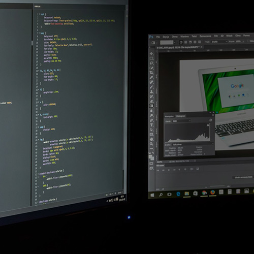

# sectional-page
A sectional web page serves as the table of contents for a section of your website and is essential to getting visitors to dig deeper into your content. In this article, [Solodev](https://www.solodev.com/) provides a well crafted example of a sectional web page.

## Tutorial

For detailed instructions, view Solodev's [Crafting an Effective Sectional Web Page](https://www.solodev.com/blog/web-design/crafting-an-effective-sectional-web-page.stml) article.

## Demo

Try out a working example on [JSFiddle](https://jsfiddle.net/solodev/nze3r0Lo/).

## HTML

The sectional web page contains the following basic HTML markup.

```
<header class="header--type2" data-background="images/hero.jpg" data-height="35%" style="background-image: url(images/hero.jpg); background-size: cover; min-height: 301.35px; -webkit-user-select: auto;">
   <div class="inner" >
      <div class="container" >
         <div class="row" >
            <div class="col-md-10" >
               <section class="ct-page_title" >
                  <div class="h1" >
                     SERVICES
                  </div>
                  <div class="ct-page_title-content" ></div>
               </section>
            </div>
         </div>
      </div>
   </div>
</header>

<div class="dynamic-sectional-subtitle" >
   <h1 >
      How it Works
   </h1>
</div>

<div class="dynamic-sectional-description" >
   <div class="container" >
      <div class="sectional-content" >
         <div class="row" >
            <div class="col-md-12 no-padding" >
                  <div class="row" >
                     <div class="col-md-4 col-sm-4 col-xs-12" >
                        <div class="sectional-box" >
                           <div class="sectional-box-image" >
                              <a href="/" ></a>
                           </div>
                           <div class="sectional-box-content" >
                              <h4 >
                                 <a href="/" >Lorem ipsum dolor</a>
                              </h4>
                              <p >
                                Lorem ipsum dolor sit amet, consectetur adipiscing elit.
                              </p>
                              <div style="clear: both; -webkit-user-select: auto;">
                              </div>
                           </div>
                        </div>
                     </div>
                     <div class="col-md-4 col-sm-4 col-xs-12" >
                        <div class="sectional-box" >
                           <div class="sectional-box-image" >
                              <a href="/" ></a>
                           </div>
                           <div class="sectional-box-content" >
                              <h4 >
                                 <a href="/" >Suspendisse ligula dui</a>
                              </h4>
                              <p >
                                 Suspendisse ligula dui, dapibus a ex at, venenatis fermentum.
                              </p>
                              <div style="clear: both;">
                              </div>
                           </div>
                        </div>
                     </div>
                     <div class="col-md-4 col-sm-4 col-xs-12" >
                        <div class="sectional-box" >
                           <div class="sectional-box-image" >
                              <a href="/" ></a>
                           </div>
                           <div class="sectional-box-content" >
                              <h4 >
                                 <a href="/" >Praesent et neque</a>
                              </h4>
                              <p >
                                 Praesent et neque ut erat dictum efficitur in quis tortor.
                              </p>
                              <div style="clear: both; -webkit-user-select: auto;">
                              </div>
                           </div>
                        </div>
                     </div>
                  </div>
                  <div class="row" style="-webkit-user-select: auto; margin-top: 75px;">
                     <div class="col-sm-6" >
                        <div class="sectional-secondary-box" >
                           <div class="col-sm-3" >
                              <a href="/" >  <i class="fa fa-link img-thumbnail" aria-hidden="true"></i></a>
                           </div>
                           <div class="col-sm-9" >
                              <h4 >
                                 <a href="/" >Lorem</a>
                              </h4>
                              <p >
                                 Vivamus quis arcu blandit, volutpat orci vitae, tempor eros. Nullam faucibus volutpat tortor. <a href="/" >Read More</a>
                              </p>
                           </div>
                        </div>
                     </div>
                     <div class="col-sm-6" >
                        <div class="sectional-secondary-box" >
                           <div class="col-sm-3" >
                              <a href="/" ><i class="fa fa-credit-card img-responsive img-thumbnail" aria-hidden="true"></i>
                              </a>
                           </div>
                           <div class="col-sm-9" >
                              <h4 >
                                 <a href="/" >Ipsum Dolor</a>
                              </h4>
                              <p >
                                 Proin quis venenatis felis. Aliquam erat volutpat. Vivamus velit lacus, auctor ut fermentum quis, vulputate et turpis. <a href="/" >Read More</a>
                              </p>
                           </div>
                        </div>
                     </div>
                  </div>
                  <div class="row" >
                     <div class="col-sm-6" >
                        <div class="sectional-secondary-box" >
                           <div class="col-sm-3" >
                              <a href="/" target="_blank" ><i class="fa fa-video-camera img-responsive img-thumbnail" aria-hidden="true"></i></a>
                           </div>
                           <div class="col-sm-9" >
                              <h4 >
                                 <a href="/" target="_blank" >Vivamus eget</a>
                              </h4>
                              <p >
                                 Mauris suscipit elit lectus, sit amet mattis sem aliquet vitae. Vivamus nec dignissim libero.  <a href="/" target="_blank" >View Tour</a>
                              </p>
                           </div>
                        </div>
                     </div>
                     <div class="col-sm-6" >
                        <div class="sectional-secondary-box" >
                           <div class="col-sm-3" >
                              <a href="/" ><i class="fa fa-camera img-responsive img-thumbnail" aria-hidden="true"></i>
                              </a>
                           </div>
                           <div class="col-sm-9" >
                              <h4 >
                                 <a href="/" >Mauris finibus</a>
                              </h4>
                              <p >
                                 Maecenas sit amet nunc mollis, lobortis elit vel, ornare magna. Ut auctor sed enim ut porttitor.  <a href="/" >View Photos</a>
                              </p>
                           </div>
                        </div>
                     </div>
                  </div>
                  <div class="row" >
                     <div class="col-sm-6" >
                        <div class="sectional-secondary-box" >
                           <div class="col-sm-3" >
                              <a href="/" ><i class="fa fa-question-circle-o img-responsive img-thumbnail" aria-hidden="true"></i>
                              </a>
                           </div>
                           <div class="col-sm-9" >
                              <h4 >
                                 <a href="/" >Nullam orci</a>
                              </h4>
                              <p >
                                 Phasellus et velit ut tortor scelerisque tincidunt. Lorem ipsum dolor sit amet, consectetur adipiscing elit.  <a href="/" >Read More</a>
                              </p>
                           </div>
                        </div>
                     </div>
                     <div class="col-sm-6" >
                        <div class="sectional-secondary-box" >
                           <div class="col-sm-3" >
                              <a href="/" ><i class="fa fa-info-circle img-responsive img-thumbnail" aria-hidden="true"></i>
                              </a>
                           </div>
                           <div class="col-sm-9" >
                              <h4 >
                                 <a href="/" >Curabitur non</a>
                              </h4>
                              <p >
                                 Nulla mollis, ligula id venenatis lobortis, nulla odio fringilla nisi, quis iaculis urna massa ac ipsum. <a href="/" >Read More</a>
                              </p>
                           </div>
                        </div>
                     </div>
                  </div>
                  <div class="row" >
                     <div class="col-sm-6" >
                        <div class="sectional-secondary-box" >
                           <div class="col-sm-3" >
                              <a href="/" ><i class="fa fa-clock-o img-responsive img-thumbnail" aria-hidden="true"></i>
                              </a>
                           </div>
                           <div class="col-sm-9" >
                              <h4 >
                                 <a href="/" >Suspendisse potenti</a>
                              </h4>
                              <p >
                                 Nam faucibus urna at ex rutrum imperdiet. Suspendisse potenti. Proin vel placerat orci. <a href="/" >View Hours</a>
                              </p>
                           </div>
                        </div>
                     </div>
                     <div class="col-sm-6" >
                        <div class="sectional-secondary-box" >
                           <div class="col-sm-3" >
                              <a href="/" ><i class="fa fa-calendar img-responsive img-thumbnail" aria-hidden="true"></i>
                              </a>
                           </div>
                           <div class="col-sm-9" >
                              <h4 >
                                 <a href="/" >Phasellus</a>
                              </h4>
                              <p >
                                Integer ac elit sed lectus tempor posuere at id mi. Phasellus sit amet nisl placerat, venenatis quam.  <a href="/" >View Calendar</a>
                              </p>
                           </div>
                        </div>
                     </div>
                  </div>
               </div>
            </div>
         </div>
      </div>
   </div>
```

## CSS

All necessary CSS can be found in sectional.css

## External Includes

This tutorial contains the following third party resources.

```
<link rel="stylesheet" href="https://maxcdn.bootstrapcdn.com/font-awesome/4.6.3/css/font-awesome.min.css">
<link rel="stylesheet" href="sectional.css">
<link href="https://maxcdn.bootstrapcdn.com/bootstrap/3.3.6/css/bootstrap.min.css" rel="stylesheet">
<script src="https://code.jquery.com/jquery-2.2.0.min.js" type="text/javascript"></script>
<script src="https://maxcdn.bootstrapcdn.com/bootstrap/3.3.6/js/bootstrap.min.js"></script>
```
